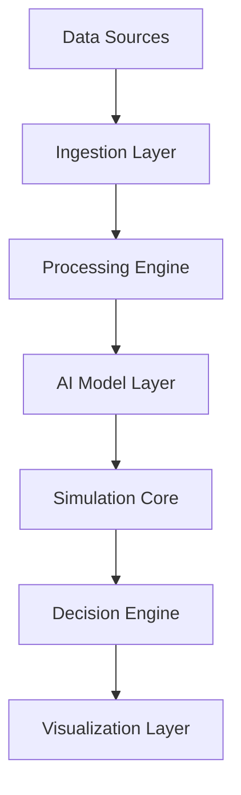

<p align="center">
   <a href="https://www.eippone.com" target="_blank">
      
    </a>
</p>


<div align="center">


*Simulate the future. Neutralize uncertainty. Make confident decisions.*

<p style="font-size:18px; color: #666;">
AI-driven Enterprise Intelligence Platform for Finance, Cybersecurity, Environmental & Research systems
</p>

<p>
  
  
  
  
  
</p>

<p>
  
  
  
  
</p>


[Website](https://www.eippone.com) •
[Documentation](https://github.com/EIPPONE) •
[Projects](https://github.com/orgs/EIPPONE/repositories)

</div>


## Welcome

EIPPONE Simulation Dynamics Inc. is a Canadian research-driven engineering company developing Simulation Intelligence platforms that help organizations explore uncertainty before it becomes reality.

Our platform combines:

- Synthetic Data Generation
- Rare Event Simulation
- Digital Twins
- Artificial Intelligence
- Decision Intelligence
- Executive Analytics


<!-- ========================= -->
<!-- QUICK NAVIGATION -->
<!-- ========================= -->

##  Table of Contents

- [Overview](#overview)
- [Vision](#vision)
- [Core Modules](#core-modules)
- [Architecture](#architecture)
- [Simulation Engine](#simulation-engine)
- [Financial Intelligence](#financial-intelligence)
- [Cyber Intelligence](#cyber-intelligence)
- [Environmental Intelligence](#environmental-intelligence)
- [Research & AI Layer](#research--ai-layer)
- [Live Demos](#live-demos)
- [Tech Stack](#tech-stack)
- [System Design](#system-design)
- [Installation](#installation)
- [Usage](#usage)
- [API Reference](#api-reference)
- [Roadmap](#roadmap)
- [Contributing](#contributing)
- [Security](#security)
- [License](#license)
- [Contact](#contact)


<!-- ========================= -->
<!-- OVERVIEW -->
<!-- ========================= -->

##  Overview

The **EIPPONE Ecosystem** is a modular intelligence platform designed to unify:

- Financial market prediction systems
- Cyber threat detection models
- Environmental analytics pipelines
- Research-grade simulation engines
- AI-driven decision support systems

It is built for **scalable intelligence orchestration** across multiple domains.


<!-- ================================= -->
<!-- VISION - Mission & Philosophy -->
<!-- ================================ -->

##  Vision

To create a unified **AI-native intelligence infrastructure** capable of:

- Predicting complex system behavior
- Simulating real-world environments
- Detecting anomalies in real time
- Supporting scientific and financial decision-making
  
**Simulate the future. Neutralize uncertainty. Make confident decisions.**

We believe organizations should be able to explore possible futures before making high-impact decisions.


## Our Mission

To build trusted AI-augmented Simulation Intelligence platforms that enable organizations to simulate, analyze and explain complex operational, financial, cyber and environmental systems.


## Engineering Philosophy

- Critical decisions should never depend on incomplete or biased data.
- AI must be explainable, auditable and governance-ready.
- Rare events matter more than averages.
- Simulation is the missing link between data and strategy.


<!-- ========================= -->
<!-- CORE MODULES -->
<!-- ========================= -->

##  Core Modules

###  Financial Intelligence
- Market prediction engine
- Risk scoring system
- Portfolio simulation
- Volatility forecasting

###  Cyber Intelligence
- Threat detection AI
- Network anomaly tracking
- Attack surface mapping
- Behavioral analytics

###  Environmental Intelligence
- Climate data modeling
- Pollution tracking systems
- Geo-spatial analytics
- Sustainability forecasting

###  Research Intelligence
- AI hypothesis testing
- Data simulation engine
- Experimental modeling
- Scientific dataset processing


<!-- ========================= -->
<!-- ARCHITECTURE -->
<!-- ========================= -->

##  Architecture


<br>
<p align="center">
   <h3> Generic Conversactional AI Systems Archtecture Overview </h3>
</p>   
<p align="center">
  
      
    </a>

</p>

<br>
<p align="center">
   <h3>  Conversational AI Systems for Enterprise Digital Twins Overview </h3>
</p> 

 <p align="center">
      
    </a>
    
</p>

 <br>
 
<p align="center">
 
      
    </a>

</p>

<br>

<p align="center">
   <h3>  Generic Conversational AI Systems for Details </h3>
</p> 

<p align="center">

      
    </a>
</p>

<br>

##  System Design

* Microservices-based architecture
* Event-driven pipelines
* Distributed AI processing
* Modular intelligence agents


<!-- ========================= -->

<!-- SIMULATION ENGINE -->

<!-- ========================= -->

##  Simulation Engine

The simulation engine models:

* Market behavior
* Cyber attack scenarios
* Environmental changes
* Multi-agent systems

### Features:

* Real-time simulation
* Stochastic modeling
* Scenario generation
* AI reinforcement feedback loops


<!-- ========================= -->

<!-- FINANCIAL INTELLIGENCE -->

<!-- ========================= -->

##  Financial Intelligence

Capabilities:

* Stock forecasting models
* Crypto trend detection
* Portfolio optimization
* Risk heatmaps
* Financial Market Simulation
* Risk Analytics
* Stress Testing
* Portfolio Analytics
* Market Forecasting

### Key Models:

* LSTM time series predictor
* Transformer-based forecasting
* Monte Carlo simulation engine


<!-- ========================= -->

<!-- CYBER INTELLIGENCE -->

<!-- ========================= -->

##  Cyber Intelligence

Features:

* Intrusion detection system (IDS)
* Log anomaly detection
* Behavioral fingerprinting
* Threat classification AI
* Threat Simulation
* Security Analytics
* SOC Intelligence
* Attack Modeling


<!-- ========================= -->

<!-- ENVIRONMENTAL -->

<!-- ========================= -->

##  Environmental Intelligence

Modules:

* Climate trend prediction
* Air quality monitoring
* Satellite data processing
* Disaster risk forecasting
* Climate Analytics
* Atmospheric Modeling
* Disaster Risk


### Enterprise Intelligence
* Operational Digital Twins
* Governance
* Compliance
* Executive Decision Support


<!-- ========================= -->

<!-- RESEARCH LAYER -->

<!-- ========================= -->

##  Research & AI Layer

We actively publish:
* Experiment tracking system
* Dataset pipeline manager
* Model benchmarking suite
* AI reasoning modules
* Open-source tools
* Benchmarks
* Sample datasets
* Reproducible research
* Reference architectures


## Platform Portfolio

| Platform | Purpose |
|----------|---------|
| EIPPONE SDG Pro | Synthetic Data Generation |
| EIPPONE RES-X | Rare Event Simulation |
| EIPPONE DT-Ops | Digital Twin Operations |
| EIPPONE A2I Insights | Executive Intelligence |
| EIPPONE A2I Copilot | Conversational Analytics |
| EIPPONE CYB-SimX | Cyber Attack Simulation |
| EIPPONE FinSim-360 | Financial Market Simulation |
| EIPPONE DQ-AI | Data Governance |
| Simulation Dynamics API Hub | Enterprise APIs |
---


<!-- ========================= -->

<!-- TECH STACK -->

<!-- ========================= -->

## Technology Ecosystem

* Artificial Intelligence
* Large Language Models
* Retrieval-Augmented Generation (RAG)
* GANs
* Digital Twins
* Monte Carlo & Rare-event Simulation
* Data Engineering
* Power BI
* Power Platform(Dataverse, Power Automate, Power Pages
* Tableau
* Azure
* Python (AI/ML Core)
* TensorFlow / PyTorch
* FastAPI
* React / Next.js
* Azure / AWS Cloud
* Docker / Kubernetes
* PostgreSQL / MongoDB
* Firebase


<!-- ========================= -->

<!-- LIVE DEMOS -->

<!-- ========================= -->

##  Live Demos

* 🔗 Financial Dashboard: `https://demo.eippone.com/finance`
* 🔗 Cyber Monitor: `https://demo.eippone.com/cyber`
* 🔗 Climate Explorer: `https://demo.eippone.com/climate`
* 🔗 Simulation Lab: `https://demo.eippone.com/sim`


<!-- ========================= -->

<!-- INSTALLATION -->

<!-- ========================= -->

##  Installation

```bash
git clone https://github.com/your-org/eippone.git
cd eippone
pip install -r requirements.txt
npm install
```

Run backend:

```bash
uvicorn app.main:app --reload
```

Run frontend:

```bash
npm run dev
```


<!-- ========================= -->

<!-- USAGE -->

<!-- ========================= -->

##  Usage

Example API call:

```bash
curl -X POST "https://api.eippone.com/predict" \
-H "Content-Type: application/json" \
-d '{"asset":"AAPL","horizon":30}'
```


<!-- ========================= -->

<!-- API -->

<!-- ========================= -->

##  API Reference

| Endpoint  | Description             |
| --------- | ----------------------- |
| /predict  | Market forecasting      |
| /detect   | Cyber anomaly detection |
| /simulate | Scenario simulation     |
| /analyze  | Data analysis engine    |


<!-- ========================= -->

<!-- ROADMAP -->

<!-- ========================= -->

##  Roadmap

* [x] Core simulation engine
* [x] Financial AI models
* [x] Cyber intelligence expansion
* [ ] Quantum simulation layer
* [ ] Global data mesh integration
* [ ] Autonomous AI agents


<!-- ========================= -->

<!-- CONTRIBUTING -->

<!-- ========================= -->

##  Contributing

We welcome contributions:

- Academic research collaborations  
- Applied AI pilots and partnerships  
- Grants, accelerators, and early-stage ventures
  
1. Fork repository
2. Create feature branch
3. Commit changes
4. Open pull request


<h3>📖 Contributor Guide - 💙 View Sponsor & Support Options<</h3>  
<a href="https://github.com/atsuvovor/CyberThreat_Insight/blob/main/CONTRIBUTING.md" target="_blank">
    
</a>

 <!-- Research Collaboration -->
  <a href="https://github.com/atsuvovor/CyberThreat_Insight/issues/new?template=research_collaboration.md" target="_blank">
    
  </a>
 <!-- Sponsors -->
  <a href="https://github.com/atsuvovor/CyberThreat_Insight/blob/main/.github/SPONSORS.md" target="_blank">
    
  </a>


<!-- ========================= -->

<!-- SECURITY -->

<!-- ========================= -->

##  Security

* Zero-trust architecture
* Encrypted data pipelines
* Secure API gateway
* Continuous vulnerability scanning


<!-- ========================= -->

<!-- LICENSE -->

<!-- ========================= -->

##  License

MIT License © 2026 EIPPONE Ecosystem


## GitHub Activity & Proof of Execution

Ongoing development, experimentation, and deployment of applied AI systems  
with a focus on rare-event modeling, computer vision, and production-ready pipelines.


---


<!-- ========================= -->

<!-- FOOTER -->

<!-- ========================= -->

<!-- ========================= -->

<!-- CONTACT -->

<!-- ========================= -->


<div align="center">
     
## Connect

🌐 https://www.eippone.com

© 2026 EIPPONE Simulation Dynamics Inc.

*Built by Atsu Vovor · Data & AI Systems*

</div>
