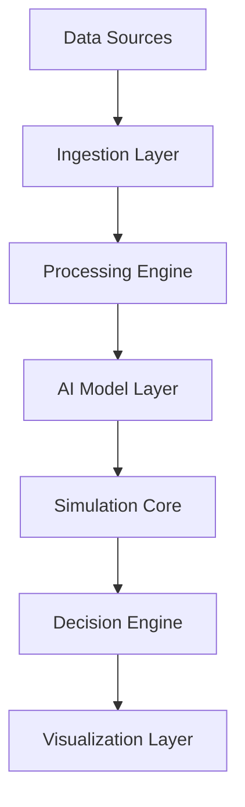

<p align="center">
   <a href="https://www.eippone.com" target="_blank">
      
    </a>
</p>


<div align="center">


*Simulate the future. Neutralize uncertainty. Make confident decisions.*

<p style="font-size:18px; color: #666;">
AI-driven intelligence platform for Finance, Cybersecurity, Environmental & Research systems
</p>

<p>
  
  
  
  
</p>


[Website](https://www.eippone.com) •
[Documentation](https://github.com/EIPPONE) •
[Projects](https://github.com/orgs/EIPPONE/repositories)

</div>


## Welcome

EIPPONE Simulation Dynamics Inc. is a Canadian research-driven engineering company developing Simulation Intelligence platforms that help organizations explore uncertainty before it becomes reality.

Our platform combines:

- Synthetic Data Generation
- Rare Event Simulation
- Digital Twins
- Artificial Intelligence
- Decision Intelligence
- Executive Analytics


---
<!-- ========================= -->
<!-- HERO SECTION -->
<!-- ========================= -->

<div align="center">

# 🌐 EIPPONE Ecosystem

### AI-Driven Intelligence Platform for Finance, Cybersecurity, Environmental & Research Systems

<p>
  
  
  
  
  
</p>

<p>
  
  
  
  
</p>

---

### 🔬 Simulate • 📊 Predict • 🛡 Protect • 🌍 Understand

</div>

---

<!-- ========================= -->
<!-- QUICK NAVIGATION -->
<!-- ========================= -->

## 📌 Table of Contents

- [Overview](#overview)
- [Vision](#vision)
- [Core Modules](#core-modules)
- [Architecture](#architecture)
- [Simulation Engine](#simulation-engine)
- [Financial Intelligence](#financial-intelligence)
- [Cyber Intelligence](#cyber-intelligence)
- [Environmental Intelligence](#environmental-intelligence)
- [Research & AI Layer](#research--ai-layer)
- [Live Demos](#live-demos)
- [Tech Stack](#tech-stack)
- [System Design](#system-design)
- [Installation](#installation)
- [Usage](#usage)
- [API Reference](#api-reference)
- [Roadmap](#roadmap)
- [Contributing](#contributing)
- [Security](#security)
- [License](#license)
- [Contact](#contact)

---

<!-- ========================= -->
<!-- OVERVIEW -->
<!-- ========================= -->

## 🧭 Overview

The **EIPPONE Ecosystem** is a modular intelligence platform designed to unify:

- Financial market prediction systems
- Cyber threat detection models
- Environmental analytics pipelines
- Research-grade simulation engines
- AI-driven decision support systems

It is built for **scalable intelligence orchestration** across multiple domains.

---

<!-- ========================= -->
<!-- VISION -->
<!-- ========================= -->

## 🎯 Vision

To create a unified **AI-native intelligence infrastructure** capable of:

- Predicting complex system behavior
- Simulating real-world environments
- Detecting anomalies in real time
- Supporting scientific and financial decision-making

---

<!-- ========================= -->
<!-- CORE MODULES -->
<!-- ========================= -->

## 🧩 Core Modules

### 💰 Financial Intelligence
- Market prediction engine
- Risk scoring system
- Portfolio simulation
- Volatility forecasting

### 🛡 Cyber Intelligence
- Threat detection AI
- Network anomaly tracking
- Attack surface mapping
- Behavioral analytics

### 🌍 Environmental Intelligence
- Climate data modeling
- Pollution tracking systems
- Geo-spatial analytics
- Sustainability forecasting

### 🔬 Research Intelligence
- AI hypothesis testing
- Data simulation engine
- Experimental modeling
- Scientific dataset processing

---

<!-- ========================= -->
<!-- ARCHITECTURE -->
<!-- ========================= -->

## 🏗 Architecture


---
## Our Vision

**Simulate the future. Neutralize uncertainty. Make confident decisions.**

We believe organizations should be able to explore possible futures before making high-impact decisions.


## Our Mission

To build trusted AI-augmented Simulation Intelligence platforms that enable organizations to simulate, analyze and explain complex operational, financial, cyber and environmental systems.


## Engineering Philosophy

- Critical decisions should never depend on incomplete or biased data.
- AI must be explainable, auditable and governance-ready.
- Rare events matter more than averages.
- Simulation is the missing link between data and strategy.


## Simulation Intelligence Architecture

```text
Real-world Data
      │
Synthetic Data
      │
Rare Event Modeling
      │
Digital Twin Simulation
      │
AI & Generative Intelligence
      │
Decision Intelligence
      │
Executive Dashboards
```


## Intelligence Domains

### Financial Market Intelligence
- Financial Market Simulation
- Risk Analytics
- Stress Testing
- Portfolio Analytics
- Market Forecasting

### Cyber Intelligence
- Threat Simulation
- Security Analytics
- SOC Intelligence
- Attack Modeling

### Environmental Intelligence
- Climate Analytics
- Atmospheric Modeling
- Disaster Risk

### Enterprise Intelligence
- Operational Digital Twins
- Governance
- Compliance
- Executive Decision Support


## Platform Portfolio

| Platform | Purpose |
|----------|---------|
| EIPPONE SDG Pro | Synthetic Data Generation |
| EIPPONE RES-X | Rare Event Simulation |
| EIPPONE DT-Ops | Digital Twin Operations |
| EIPPONE A2I Insights | Executive Intelligence |
| EIPPONE A2I Copilot | Conversational Analytics |
| EIPPONE CYB-SimX | Cyber Attack Simulation |
| EIPPONE FinSim-360 | Financial Market Simulation |
| EIPPONE DQ-AI | Data Governance |
| Simulation Dynamics API Hub | Enterprise APIs |


## Technology Ecosystem

- Artificial Intelligence
- Large Language Models
- Retrieval-Augmented Generation (RAG)
- GANs
- Digital Twins
- Monte Carlo & Rare-event Simulation
- Data Engineering
- Power BI
- Tableau
- Python
- Azure


## Open Research

We actively publish:
- Open-source tools
- Benchmarks
- Sample datasets
- Reproducible research
- Reference architectures

---

<div align="center">
      
## Connect

🌐 https://www.eippone.com


© 2026 EIPPONE Simulation Dynamics Inc.


*Built by Atsu Vovor · Data & AI Systems*


